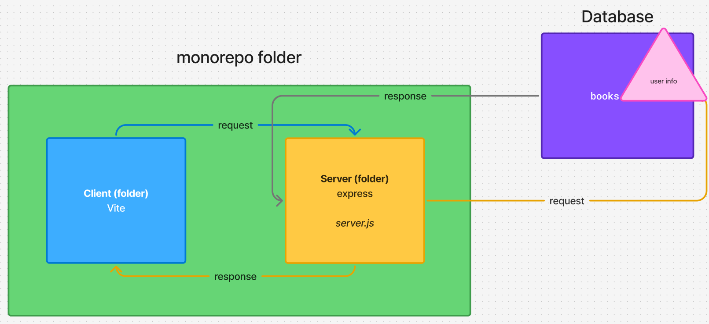

# Render the database results, refresh the page after form submission

Chunky stuff here but only because there are a lot of moving parts.

I'm hoping these bullets help to clear it up!

## The goal:

> After the user submits the form, allow the page to display all of the new database content, without hitting 'refresh'

Whew.

OK. Sounds like we need to be able to 'check' something for success.

## Help

Repeat after me:

- Web Request Response Cycle
- Web Request Response Cycle
- Web Request Response Cycle!!

Bear this in mind, as there are a few moving parts, and we're shifting from `client` to `server` to `database` a bit!

This image may help you trace your path:



### Client `main.js` handleSubmit

The POST `fetch()` request has to be `await`ed, within an `async` function

```js
const serverResponse = await fetch("http://localhost:8080/books", {
  method: "POST",
  body: JSON.stringify(formValues),
  headers: {
    "Content-Type": "application/json",
  },
});
```

You _could_ just invoke your `fetch()` function after this, and the page would automatically reload the newest posts. Together, it'd look like so

```js
async function handleSubmit(event) {
  event.preventDefault();
  const data = new FormData(userBookForm);
  const formValues = Object.fromEntries(data);

  const serverResponse = await fetch("http://localhost:8080/books", {
    method: "POST",
    body: JSON.stringify(formValues),
    headers: {
      "Content-Type": "application/json",
    },
  });

  getAllBooks();
}
```

However, that's not _really_ the best way to handle the situation.

What if the form values didn't make it to the server?

What if the form didn't upload to the database correctly?

We can handle it better!

#### Handling a servers response

After your `const serverResponse = await fetch`, and before `getAllBooks()` add a line to parse the response:

```js
const parsedResponse = await serverResponse.json();
```

Now let's hop to the server you've made so it actually sends something to the client.

### Server `server.js` /books `POST` route

Currently we've just made a standalone db.query in the `app.post` route:

```js
db.query(`Your SQL stuff in here...`);
```

Our code needs to make a decision dependant on the response the database gives. So, we need to await a response from the database and send it back:

```js
app.post("/books", async function (request, response) {
  const databaseResponse = await db.query(
    `
  INSERT INTO books 
  (title, img_source, img_alt, author, release_year) 
  VALUES 
  ($1, $2, $3, $4, $5)`,
    [
      request.body.userTitle,
      request.body.userImgSrc,
      request.body.userImgAlt,
      request.body.userAuthor,
      request.body.userReleaseYear,
    ]
  );

  response.send(databaseResponse); // send back to the client
});
```

The client will now receive some data back from the server. Woop!

### Client `main.js` making a decision

The thing which is going to help us make a decision is the `rowCount` from the database.

In your clients `main.js`, add this under your `fetch()` request:

```js
const parsedResponse = await serverResponse.json();
console.log(parsedResponse);
```

and check out what `parsedResponse` is in your clients console.

You should see an object containing information _(from the database)_ about how the `INSERT` went.

From here, we can use the `rowCount` in a `conditional`, and if it's `== 1`, do some stuff!

```js
if (parsedResponse.rowCount == 1) {
  getAllBooks(); // invoke our function that fetches/gets the data from the database and renders it to the page

  userBookForm.reset(); // for added flavour if you like, clear the form, because it was a success!
}
```

🤙🤙🤙🫠 Woo! 🎉🎉🎉

### Ensure that the results are in the order of newest first

Probably the best way to do it is in your SQL statement in your `server.js`:
https://www.w3schools.com/sql/sql_ref_order_by.asp

Otherwise you could use a `.reverse()` method on the array in the `client`

```js
async function getAllBooks() {
  booksContainer.innerHTML = "";
  const response = await fetch(
    "https://di003-week-09-full-stack-server.onrender.com/books"
  );
  const booksData = await response.json();

  booksData.reverse().forEach((book) => {
    // etc etc etc
  });
}
```
